# SecondBrain — Manual de Usuario

**Value Strategy Consulting**
**Version:** 3.0 | **Febrero 2026**

---

## Tabla de Contenidos

1. [Introduccion](#1-introduccion)
2. [Arquitectura](#2-arquitectura)
3. [Requisitos e Instalacion](#3-requisitos-e-instalacion)
4. [Dashboard — Guia de Uso](#4-dashboard--guia-de-uso)
   - [4.1 Login y Usuarios](#41-login-y-usuarios)
   - [4.2 Captura de Ideas](#42-captura-de-ideas)
   - [4.3 Pipeline CODE](#43-pipeline-code)
   - [4.4 Organizacion PARA](#44-organizacion-para)
   - [4.5 Productividad GTD](#45-productividad-gtd)
   - [4.6 Chat con IA](#46-chat-con-ia)
   - [4.7 Ejecucion con Agentes](#47-ejecucion-con-agentes)
   - [4.8 Archivos y Conocimiento](#48-archivos-y-conocimiento)
   - [4.9 Analytics](#49-analytics)
   - [4.10 Reportabilidad](#410-reportabilidad)
5. [OpenClaw — Orquestador Autonomo](#5-openclaw--orquestador-autonomo)
   - [5.1 Los 6 Agentes](#51-los-6-agentes)
   - [5.2 Pipeline Software](#52-pipeline-software)
   - [5.3 Pipeline Consulting](#53-pipeline-consulting)
   - [5.4 Monitor de Agentes](#54-monitor-de-agentes)
   - [5.5 Configuracion de OpenClaw](#55-configuracion-de-openclaw)
6. [Despliegue con Docker](#6-despliegue-con-docker)
7. [API para Integraciones](#7-api-para-integraciones)
8. [Seguridad](#8-seguridad)
9. [Solucion de Problemas](#9-solucion-de-problemas)

---

## 1. Introduccion

**SecondBrain** es la plataforma de gestion de conocimiento e inteligencia operativa de Value Strategy Consulting. Combina tres metodologias probadas:

- **CODE** (Capture, Organize, Distill, Express) — transforma ideas crudas en outputs profesionales
- **PARA** (Projects, Areas, Resources, Archives) — organiza todo el conocimiento corporativo
- **GTD** (Getting Things Done) — gestiona compromisos, contextos y energia del equipo

El sistema tiene dos componentes principales:

| Componente | Que hace | Tecnologia |
|:-----------|:---------|:-----------|
| **Dashboard** | Interfaz web donde el equipo captura, organiza y ejecuta | Node.js, Express, SQLite |
| **OpenClaw** | Orquestador autonomo con 6 agentes IA que procesan ideas en segundo plano | Python, Gemini, Claude, Ollama |

Ambos comparten la misma base de datos SQLite (modo WAL para acceso concurrente seguro).

---

## 2. Arquitectura

```mermaid
graph TB
    subgraph Dashboard["<b>Dashboard</b> — Node.js :3000"]
        IDEAS["📥 Ideas<br/>CODE Flow"]
        CHAT["💬 Chat<br/>RAG + IA"]
        MONITOR["🦞 Monitor<br/>OpenClaw"]
        ANALYTICS["📈 Analytics"]
        GTD["🎯 GTD"]
    end

    DB[("🗄️ SQLite<br/>WAL mode<br/>13 tablas, 14 indexes")]

    subgraph OpenClaw["<b>OpenClaw</b> — Python 3.12 — 6 agentes autonomos"]
        PM["📋 PM<br/>Project Manager"]
        DEV["💻 DEV<br/>Ingeniero"]
        BUILDER["🔨 BUILDER<br/>Constructor"]
        QA["🔍 QA<br/>Revisor Codigo"]
        CONSULTING["📊 CONSULTING<br/>Consultor"]
        REVIEWER["📝 REVIEWER<br/>Director Calidad"]

        PM -->|"Software"| DEV --> BUILDER --> QA
        PM -->|"Consulting"| CONSULTING --> REVIEWER
    end

    Dashboard <-->|"WAL concurrente"| DB
    OpenClaw <-->|"WAL concurrente"| DB
```



### Cadena de Fallback IA

Los agentes intentan usar modelos en este orden. Si uno falla, pasan al siguiente:

```mermaid
graph LR
    A["☁️ Google Gemini<br/><small>gemini-3-flash-preview</small>"] -->|"falla"| B["☁️ Anthropic Claude<br/><small>claude-sonnet-4-6</small>"]
    B -->|"falla"| C["🏠 Ollama Local<br/><small>llama3.2</small>"]

    style A fill:#4285f4,color:#fff
    style B fill:#d97706,color:#fff
    style C fill:#059669,color:#fff
```



---

## 3. Requisitos e Instalacion

### Requisitos

- **Node.js** 20+ (para el dashboard)
- **Python** 3.12+ (para OpenClaw)
- **Google Gemini API Key** — [obtener aqui](https://aistudio.google.com/apikey)
- (Opcional) **Anthropic API Key** — para agentes QA y Reviewer
- (Opcional) **Ollama** — modelo local de fallback (`ollama serve` con `llama3.2`)
- (Opcional) **Docker** — para despliegue containerizado
- **Navegador**: Chrome, Edge o Brave (soporte Web Speech API para notas de voz)

### Instalacion Local

```bash
# 1. Dashboard
cd apps/dashboard
npm install
cp .env.example .env
# Editar .env con GEMINI_API_KEY y SESSION_SECRET

# 2. OpenClaw
cd ../../openclaw
python -m venv venv
venv\Scripts\activate          # Windows
# source venv/bin/activate     # Linux/Mac
pip install -r requirements.txt
cp .env.example .env
# Editar .env con GEMINI_API_KEY y ANTHROPIC_API_KEY
```

### Iniciar

```bash
# Terminal 1 — Dashboard
cd apps/dashboard
npm start
# Abre http://localhost:3000

# Terminal 2 — OpenClaw (opcional, para procesamiento autonomo)
cd openclaw
venv\Scripts\activate
python main.py
```

### Instalacion con Docker (recomendada)

```bash
# Configurar variables de entorno
cp apps/dashboard/.env.example apps/dashboard/.env
cp openclaw/.env.example openclaw/.env
# Editar ambos .env con tus API Keys

# Levantar todo
docker compose up -d

# Ver logs
docker compose logs -f

# Parar
docker compose down
```

---

## 4. Dashboard — Guia de Uso

### 4.1 Login y Usuarios

Abrir `http://localhost:3000/login` con las credenciales de tu equipo.

**Usuarios por defecto:**

| Usuario | Password | Rol | Departamento | Expertise |
|:--------|:---------|:----|:-------------|:----------|
| david | vsc2026 | admin | Direccion | Estrategia, Operaciones, Gestion |
| gonzalo | vsc2026 | manager | Operaciones | HSE, Ejecucion, Contratos |
| jose | vsc2026 | analyst | Finanzas | Finanzas, Presupuestos, Analisis |

> Cambiar las contrasenas en produccion desde la seccion de configuracion.

**Roles:**
- **admin** — Acceso total, gestion de usuarios, importar/exportar datos
- **manager** — Puede ejecutar agentes, ver reportabilidad de su equipo
- **analyst** — Puede capturar ideas, ver sus propias asignaciones

### 4.2 Captura de Ideas

La seccion **Ideas** es el punto de entrada principal. Hay dos formas de capturar:

**Texto:**
1. Escribir la idea en el campo de texto
2. Click en "Capturar"
3. La IA automaticamente clasifica tipo, categoria, prioridad, asigna persona y area

**Voz:**
1. Click en el icono de microfono
2. Hablar naturalmente — el sistema limpia muletillas ("eh", "o sea", "bueno")
3. Si el audio contiene multiples ideas, la IA las separa automaticamente
4. Cada idea se clasifica y asigna individualmente

**Que clasifica la IA automaticamente:**

| Campo | Valores posibles |
|:------|:-----------------|
| Tipo | Tarea, Proyecto, Nota, Delegacion, Referencia |
| Categoria | Operaciones, Finanzas, HSE, RRHH, Estrategia, etc. |
| Prioridad | alta, media, baja |
| Persona asignada | Segun expertise del equipo |
| Area PARA | Segun areas activas |
| Contexto GTD | @computador, @email, @telefono, @oficina, etc. |
| Nivel de energia | baja, media, alta |
| Agente sugerido | staffing, training, finance, compliance, gtd |

Las ideas con baja confianza de clasificacion se marcan para revision humana.

### 4.3 Pipeline CODE

Cada idea pasa por 4 etapas del flujo CODE:

```mermaid
graph LR
    C["📥 <b>Captured</b><br/><small>Idea cruda del usuario</small>"]
    O["📂 <b>Organized</b><br/><small>IA clasifica y asigna</small>"]
    D["💎 <b>Distilled</b><br/><small>Esencia + proxima accion</small>"]
    E["🚀 <b>Expressed</b><br/><small>Output profesional</small>"]

    C -->|"IA automatica"| O -->|"IA o agente"| D -->|"Agente especializado"| E

    style C fill:#f59e0b,color:#000
    style O fill:#3b82f6,color:#fff
    style D fill:#8b5cf6,color:#fff
    style E fill:#10b981,color:#fff
```



| Etapa | Que sucede | Quien lo hace |
|:------|:-----------|:-------------|
| **Captured** | La idea entra al sistema tal como fue dictada/escrita | Usuario |
| **Organized** | IA clasifica, asigna persona, area, prioridad y contexto | IA automatica |
| **Distilled** | Se extrae la esencia: proxima accion concreta, resumen ejecutivo | IA o agente |
| **Expressed** | Se genera output profesional (plan, presupuesto, auditoria, codigo) | Agente especializado |

Puedes avanzar manualmente una idea por las etapas, o dejar que OpenClaw la procese automaticamente.

### 4.4 Organizacion PARA

Todo el conocimiento se organiza en 4 categorias PARA:

- **Projects** — Iniciativas con deadline y objetivo claro. Se descomponen automaticamente en sub-tareas.
- **Areas** — Responsabilidades continuas (Operaciones, HSE, Finanzas, RRHH, etc.). No tienen fecha de fin.
- **Resources** — Memoria corporativa DRY: contexto permanente que los agentes consultan para tomar decisiones.
- **Archives** — Items inactivos o completados.

Las areas se gestionan en la seccion **Areas** del dashboard. Cada area tiene nombre, descripcion, responsable y estado.

### 4.5 Productividad GTD

SecondBrain implementa Getting Things Done con las siguientes funcionalidades:

**Proximas Acciones** (seccion GTD Board):
- Vistas por contexto (@computador, @email, @telefono, @oficina, @calle, @casa, @espera, @compras, @investigar, @reunion, @leer)
- Vistas por energia (baja, media, alta)
- Vista por persona asignada

**Proyectos GTD** (seccion GTD Projects):
- Ideas que la IA o OpenClaw marcaron como proyecto
- Incluye proyectos de software construidos por OpenClaw

**Checklist Diario:**
- Lista personalizada por usuario
- Marca progreso durante el dia

**Reporte Diario:**
- Generado automaticamente por IA
- Resume que se hizo, que queda pendiente y que necesita atencion

**Delegaciones (Waiting For):**
- Tracking de compromisos delegados a terceros
- Fecha de delegacion y seguimiento

### 4.6 Chat con IA

La seccion **Chat** permite conversar con la IA de forma contextual:

- Tiene acceso a toda la memoria corporativa (Resources/context_items)
- Historial de conversacion persistente por sesion
- Puede discutir sobre skills de la biblioteca
- Respuestas en Markdown con formato profesional
- Dos modos especiales:
  - **Research Agent** — Investigacion profunda sobre un tema
  - **Review Agent** — Revision critica de un documento o plan

### 4.7 Ejecucion con Agentes

Cuando la IA detecta que una idea puede ejecutarse con un agente especializado:

1. Aparece un badge con el agente sugerido en la tarjeta (ej: "Staffing")
2. Click en "Ejecutar con [Agente]"
3. Confirmar agente y skills en el modal
4. El sistema genera el output (15-30 segundos)
5. El output queda vinculado a la idea y puede verse en cualquier momento

**Agentes del dashboard:**

| Agente | Especialidad | Skills/SOPs que usa |
|:-------|:-------------|:--------------------|
| Staffing | Dotacion, turnos, personal | create-staffing-plan, model-staffing-requirements |
| Training | Capacitacion, formacion | create-training-plan |
| Finance | Presupuestos, costos, OPEX | model-opex-budget |
| Compliance | Auditorias, cumplimiento | audit-compliance-readiness |
| GTD | Clasificacion, descomposicion | classify-idea, decompose-project, identify-next-action |

Los Skills son SOPs en formato Markdown ubicados en `core/skills/`. Pueden editarse para adaptar el comportamiento de los agentes.

### 4.8 Archivos y Conocimiento

La seccion **Archivos** permite gestionar documentos del conocimiento corporativo:

- Formatos soportados: `.md`, `.pdf`, `.txt`, `.docx`
- Sistema de tags para organizacion
- Busqueda por nombre y contenido
- Visor integrado de Markdown y PDF

La seccion **Skills** muestra la biblioteca de SOPs disponibles con visor integrado.

### 4.9 Analytics

La seccion **Analytics** muestra metricas del sistema:

- Ideas por etapa CODE (captured → organized → distilled → expressed)
- Distribucion PARA (projects, areas, resources, archives)
- Ideas por dia/semana y tasas de completacion
- Productividad por usuario
- Areas mas activas

### 4.10 Reportabilidad

La seccion **Reportabilidad** muestra las asignaciones del equipo:

- Que tiene cada persona asignado
- Estado de cada asignacion
- Carga de trabajo por miembro

---

## 5. OpenClaw — Orquestador Autonomo

OpenClaw es el motor autonomo que procesa ideas en segundo plano. Lee ideas organizadas del dashboard y las convierte en software funcional o documentos profesionales sin intervencion humana.

### 5.1 Los 6 Agentes

| Agente | Motor IA | Ciclo | Funcion |
|:-------|:---------|:------|:--------|
| **PM** | Gemini | 30s | Project Manager: lee ideas organizadas y decide si van al pipeline de Software o Consulting |
| **DEV** | Gemini + Ollama | 60s | Ingeniero: genera codigo fuente completo con estructura de archivos |
| **BUILDER** | subprocess | 45s | Constructor: escribe archivos a disco, crea venv, instala dependencias, valida sintaxis, ejecuta el proyecto |
| **QA** | Claude | 60s | Control de calidad: revisa codigo construido, aprueba o rechaza con feedback |
| **CONSULTING** | Gemini + Skills | 45s | Consultor: genera documentos profesionales usando SOPs como instrucciones |
| **REVIEWER** | Claude | 90s | Director de calidad: revisa documentos de consultoria, aprueba o rechaza |

### 5.2 Pipeline Software

Cuando el PM clasifica una idea como software:

```mermaid
graph LR
    PM["📋 PM"] -->|"queued_software"| DEV["💻 DEV"]
    DEV -->|"developed"| BUILDER["🔨 BUILDER"]
    BUILDER -->|"built"| QA["🔍 QA"]
    QA -->|"✅ aprueba"| DONE["completed"]
    BUILDER -.->|"❌ falla (max 3)"| DEV
    QA -.->|"❌ rechaza"| DEV

    style DONE fill:#10b981,color:#fff
```



**Paso a paso:**

1. **PM** lee la idea organizada y determina que es software. La marca como `queued_software`.
2. **DEV** toma la idea, genera codigo completo con estructura de archivos (main.py, requirements.txt, templates, etc.). La marca como `developed`.
3. **BUILDER** toma el codigo generado y:
   - Extrae archivos del output del DEV
   - Los escribe a disco en `openclaw/projects/{idea_id}/`
   - Crea un entorno virtual Python (`venv`)
   - Instala dependencias (`pip install -r requirements.txt`)
   - Valida sintaxis de cada archivo `.py`
   - Intenta ejecutar el proyecto (detecta si es script o webapp)
   - Si todo funciona → marca como `built`
   - Si falla → devuelve al DEV con el error detallado (`queued_software`)
   - Despues de 3 fallos consecutivos → marca como `blocked`
   - Registra el proyecto en la tabla `projects` del dashboard
4. **QA** revisa el codigo construido evaluando funcionalidad, bugs y seguridad. Aprueba → `completed` o rechaza → vuelve al DEV.

**Proyectos construidos:**

Los proyectos quedan en `openclaw/projects/{id}/` con su propio venv aislado. Las webapps se asignan al puerto `5100 + (id % 1000)`.

### 5.3 Pipeline Consulting

Cuando el PM clasifica una idea como consultoria:

```mermaid
graph LR
    PM["📋 PM"] -->|"queued_consulting"| CON["📊 CONSULTING"]
    CON -->|"reviewing"| REV["📝 REVIEWER"]
    REV -->|"✅ aprueba"| DONE["completed"]
    REV -.->|"❌ rechaza"| CON

    style DONE fill:#10b981,color:#fff
```



**Paso a paso:**

1. **PM** detecta que la idea tiene un `suggested_agent` (staffing, training, finance, compliance) o `suggested_skills`. La marca como `queued_consulting`.
2. **CONSULTING** toma la idea, carga los Skills/SOPs correspondientes desde `core/skills/`, y genera un documento profesional (plan de dotacion, presupuesto OPEX, auditoria, etc.). La marca como `reviewing`.
3. **REVIEWER** evalua el documento en completitud, profesionalismo y adherencia al SOP. Aprueba → `completed` o rechaza → vuelve al CONSULTING con feedback.

### 5.4 Monitor de Agentes

El dashboard incluye una seccion **Monitor Agentes** (icono de langosta en la navegacion lateral) que muestra el estado de OpenClaw en tiempo real:

**Pipeline visual:**


Cada etapa muestra el numero de ideas actualmente en ese estado.

**Contadores adicionales:**
- Fallidos — Ideas que fallaron (reintentables)
- Bloqueados — Ideas que fallaron 3+ veces (requieren intervencion)
- Proyectos — Total de proyectos construidos por BUILDER

**Estado de Agentes:**
Tarjeta por cada agente mostrando:
- Nombre e icono del agente
- Ultimo momento activo
- Total de ideas procesadas
- Indicador verde si estuvo activo en los ultimos 5 minutos

**Feed de Actividad:**
Las ultimas 20 ideas procesadas con el agente que las proceso, estado resultante y timestamp.

### 5.5 Configuracion de OpenClaw

Variables de entorno en `openclaw/.env`:

```env
# API Keys (al menos una requerida)
GEMINI_API_KEY=tu-key-de-gemini
ANTHROPIC_API_KEY=tu-key-de-claude

# Modelos
GEMINI_MODEL=gemini-3-flash-preview      # Para PM, DEV, CONSULTING
CLAUDE_MODEL=claude-sonnet-4-6            # Para QA, REVIEWER
LOCAL_MODEL=llama3.2                       # Fallback local con Ollama
OLLAMA_URL=http://localhost:11434/api/generate

# Base de datos (relativo a openclaw/)
DB_PATH=../apps/dashboard/data/second_brain.db

# Skills (relativo a openclaw/)
SKILLS_DIR=../core/skills

# Intervalos entre ciclos (segundos)
INTERVALO_PM=30          # Cada cuanto el PM busca ideas nuevas
INTERVALO_DEV=60         # Cada cuanto el DEV busca ideas en cola
INTERVALO_BUILDER=45     # Cada cuanto el BUILDER busca codigo para construir
INTERVALO_QA=60          # Cada cuanto QA busca codigo para revisar
INTERVALO_CONSULTING=45  # Cada cuanto CONSULTING busca ideas de consultoria
INTERVALO_REVIEWER=90    # Cada cuanto REVIEWER busca documentos para revisar
```

**Ejecutar un solo agente** (util para debugging):

```bash
python main.py --solo pm        # Solo el Project Manager
python main.py --solo dev       # Solo el Developer
python main.py --solo builder   # Solo el Builder
python main.py --solo qa        # Solo QA
python main.py --solo consulting # Solo Consulting
python main.py --solo reviewer  # Solo el Reviewer
```

---

## 6. Despliegue con Docker

```mermaid
graph TB
    subgraph Docker["Docker Compose"]
        DASH["🟢 secondbrain-dashboard<br/><small>Node 20 Alpine — :3000</small>"]
        OC["🟢 secondbrain-openclaw<br/><small>Python 3.12 slim</small>"]
    end

    VOL_DB[("sb-data<br/><small>SQLite compartida</small>")]
    VOL_PROJ[("openclaw-projects<br/><small>Proyectos construidos</small>")]
    SKILLS["📚 ./core/skills<br/><small>SOPs (bind mount)</small>"]

    DASH <--> VOL_DB
    OC <--> VOL_DB
    OC <--> VOL_PROJ
    OC <--> SKILLS
    DASH <--> SKILLS

    OC -.->|"depends_on<br/>healthcheck"| DASH
    USER["🌐 Usuario"] -->|":3000"| DASH

    style DASH fill:#10b981,color:#fff
    style OC fill:#3b82f6,color:#fff
```



Docker Compose levanta todo el ecosistema con un solo comando:

```bash
docker compose up -d
```

Esto crea dos contenedores:

| Contenedor | Imagen | Puerto | Funcion |
|:-----------|:-------|:-------|:--------|
| secondbrain-dashboard | Node 20 Alpine | 3000 | Dashboard web |
| secondbrain-openclaw | Python 3.12 slim | — | Agentes autonomos |

**Volumenes compartidos:**
- `sb-data` — Base de datos SQLite compartida entre dashboard y OpenClaw
- `openclaw-projects` — Proyectos construidos por BUILDER
- `./core/skills` — SOPs compartidos

**Health check:** OpenClaw espera a que el dashboard responda en `/health` antes de iniciar.

**Comandos utiles:**

```bash
docker compose logs -f              # Ver logs en tiempo real
docker compose logs openclaw        # Logs solo de OpenClaw
docker compose restart openclaw     # Reiniciar solo OpenClaw
docker compose down                 # Parar todo
docker compose up -d --build        # Rebuild y reiniciar
```

---

## 7. API para Integraciones

### Autenticacion

Dos metodos:

1. **Session** — Login via `/login` (navegador web)
2. **API Key** — Header `X-API-Key: sb_xxxxx` (integraciones externas)

### Endpoints principales

| Metodo | Ruta | Descripcion |
|:-------|:-----|:------------|
| GET | `/health` | Health check (publico) |
| POST | `/login` | Iniciar sesion |
| GET | `/api/ideas` | Listar ideas con filtros |
| POST | `/api/ideas` | Crear idea con clasificacion IA |
| POST | `/api/ideas/voice` | Subir nota de voz |
| POST | `/api/ideas/:id/organize` | Organizar idea (CODE) |
| POST | `/api/ideas/:id/distill` | Destilar idea (CODE) |
| POST | `/api/ideas/:id/express` | Expresar idea (CODE) |
| POST | `/api/ideas/:id/execute` | Ejecutar con agente |
| POST | `/api/ideas/:id/complete` | Marcar completada |
| POST | `/api/ideas/:id/decompose` | Descomponer en sub-tareas |
| PUT | `/api/ideas/:id/gtd` | Actualizar campos GTD |
| POST | `/api/ai/chat` | Chat con IA |
| POST | `/api/ai/research` | Investigacion profunda |
| POST | `/api/ai/review` | Revision critica |
| GET | `/api/ai/context` | Memoria corporativa |
| GET | `/api/areas` | Listar areas PARA |
| GET | `/api/stats/analytics` | Analytics avanzados |
| GET | `/api/gtd/daily-report` | Reporte diario IA |
| GET | `/api/checklist/:user` | Checklist diario |
| GET | `/api/search` | Busqueda global |
| POST | `/api/external/capture` | Captura externa (API Key) |
| GET | `/api/export` | Exportar datos (JSON) |
| POST | `/api/import` | Importar datos (admin) |
| GET | `/admin/openclaw/status` | Estado de OpenClaw (pipeline + agentes) |

### Ejemplo: Captura externa

```bash
curl -X POST http://localhost:3000/api/external/capture \
  -H "Content-Type: application/json" \
  -H "X-API-Key: sb_tu-api-key" \
  -d '{"text": "Revisar presupuesto Q2 del proyecto ACME", "source": "externo"}'
```

### Rate Limiting

| Scope | Limite |
|:------|:-------|
| API general | 200 req / 15 min |
| Endpoints IA | 15 req / 1 min |
| Login | 10 intentos / 15 min |
| Uploads | 10 req / 1 min |

---

## 8. Seguridad

| Medida | Implementacion |
|:-------|:---------------|
| Headers HTTP | Helmet (CSP, X-Frame-Options, HSTS) |
| Passwords | bcrypt con salt rounds = 10 |
| Rate Limiting | Por endpoint (API, AI, Login, Upload) |
| IDOR | Middleware `requireOwnerOrAdmin` en recursos sensibles |
| RBAC | Roles admin, manager, analyst con `requireAdmin` |
| Sesiones | httpOnly, sameSite: lax, secure en produccion |
| SQL Injection | Queries 100% parametrizadas |
| CORS | Configurable por entorno |
| Input Validation | Middleware con sanitizacion |
| XSS | DOMPurify en frontend, `escapeHtml` en backend |

---

## 9. Solucion de Problemas

| Problema | Causa | Solucion |
|:---------|:------|:---------|
| Dashboard no inicia en puerto 3000 | Puerto ocupado o Node.js no instalado | Verificar `node --version` (20+). Cerrar procesos en el puerto: `npx kill-port 3000` |
| OpenClaw no procesa ideas | API keys no configuradas | Verificar `openclaw/.env` tiene GEMINI_API_KEY. Revisar logs en `openclaw/logs/` |
| IA no responde en el chat | API Key invalida o sin credito | Revisar logs del dashboard. Verificar la key en [AI Studio](https://aistudio.google.com/apikey) |
| BUILDER falla al construir | Dependencias incompatibles o sintaxis invalida | Revisar `openclaw/projects/{id}/` y los logs. El error se guarda en `execution_error` de la idea |
| Ideas no avanzan en el pipeline | OpenClaw no esta corriendo | Iniciar con `python main.py`. Verificar en Monitor Agentes que los agentes aparecen activos |
| Notas de voz no funcionan | Navegador sin soporte Web Speech API | Usar Chrome, Edge o Brave. Verificar que el navegador tiene permiso de microfono |
| Docker no levanta OpenClaw | Dashboard no paso health check | Verificar que el dashboard esta healthy: `docker compose ps`. Revisar `docker compose logs dashboard` |
| "Database is locked" | Multiples procesos escribiendo a la vez | SQLite WAL deberia manejar esto. Si persiste, reiniciar OpenClaw. Verificar que no hay otro proceso accediendo la BD |

### Logs

- **Dashboard:** Salida en la terminal donde se ejecuta `npm start`
- **OpenClaw:** Archivos en `openclaw/logs/openclaw.log` con rotacion diaria (14 dias de retencion)
- **Docker:** `docker compose logs -f` para ambos contenedores

### Resetear el sistema

Si necesitas empezar de cero:

```bash
# 1. Parar todo
docker compose down  # si usas Docker
# o Ctrl+C en las terminales

# 2. Eliminar la BD (CUIDADO: borra todo)
rm apps/dashboard/data/second_brain.db

# 3. Eliminar proyectos construidos
rm -rf openclaw/projects/*/

# 4. Reiniciar — el dashboard recrea la BD automaticamente
npm start  # o docker compose up -d
```

---

**Value Strategy Consulting** | SecondBrain v3.0
