# SecondBrain Dashboard

**Sistema de gestion de conocimiento corporativo con IA** para Value Strategy Consulting.

Implementa las metodologias **CODE** (Capture, Organize, Distill, Express), **PARA** (Projects, Areas, Resources, Archives) y **GTD** (Getting Things Done) con un motor de IA (Google Gemini) que clasifica, asigna y ejecuta automaticamente.

## Arquitectura

```mermaid
graph TB
    subgraph Dashboard["<b>Dashboard</b> — Node.js :3000"]
        FE["Frontend<br/>EJS + Vanilla JS"]
        API["Express.js API<br/>50+ endpoints, 9 route files"]
        MW["Middleware<br/>Auth + RBAC"]
        AI["AI Service<br/>Google Gemini"]
        FE --> API
        API --> MW
        API --> AI
    end

    DB[("SQLite<br/>WAL mode<br/>13 tablas")]

    subgraph OpenClaw["<b>OpenClaw</b> — Python 3.12"]
        PM["📋 PM<br/>Router"]
        DEV["💻 DEV<br/>Code Gen"]
        BUILDER["🔨 BUILDER<br/>Build & Run"]
        QA["🔍 QA<br/>Code Review"]
        CONSULTING["📊 CONSULTING<br/>Documents"]
        REVIEWER["📝 REVIEWER<br/>Doc Review"]

        PM -->|Software| DEV
        DEV --> BUILDER
        BUILDER --> QA
        PM -->|Consulting| CONSULTING
        CONSULTING --> REVIEWER
    end

    Dashboard <-->|"WAL concurrente"| DB
    OpenClaw <-->|"WAL concurrente"| DB
    CONSULTING -.->|"lee SOPs"| Skills["📚 core/skills/<br/>9 SOPs en Markdown"]
```



## Funcionalidades

### Gestion de Ideas (CODE Flow)

- **Capture**: Texto libre o nota de voz (grabacion WebM con transcripcion en tiempo real)
- **Organize**: IA clasifica tipo, categoria, prioridad, asigna persona y area
- **Distill**: IA extrae la esencia y proxima accion concreta
- **Express**: Genera output profesional (plan, presupuesto, auditoria)

### Organizacion (PARA)

- **Projects**: Proyectos con deadline, descomposicion automatica en sub-tareas
- **Areas**: Areas de responsabilidad continuas (Operaciones, HSE, Finanzas, etc.)
- **Resources**: Contexto permanente — memoria corporativa DRY
- **Archives**: Items inactivos

### Productividad (GTD)

- Contextos de ejecucion (@computador, @email, @telefono, @oficina, @calle, @casa, @espera, @compras, @investigar, @reunion, @leer)
- Niveles de energia (baja, media, alta)
- Tipos de compromiso (comprometida, esta_semana, algun_dia, tal_vez)
- Lista "Waiting For" para delegaciones
- Checklist diario por usuario
- Reporte diario generado por IA
- Metricas de efectividad GTD

### Pipeline de Ejecucion con Agentes

- IA sugiere agente automaticamente (Staffing, Training, Finance, Compliance, GTD)
- Cada agente usa Skills (SOPs en Markdown) como instrucciones
- Genera documentos profesionales (planes de dotacion, presupuestos OPEX, auditorias)
- Output guardado y vinculado a la idea original

### Otras funciones

- Chat con IA (contexto conversacional + RAG desde memoria corporativa)
- Agente de investigacion profunda (Research Agent)
- Agente de revision critica (Review Agent)
- Gestion de archivos con tags (.md, .pdf, .txt, .docx)
- Biblioteca de Skills con visor integrado
- Analytics y estadisticas avanzadas
- Busqueda global (ideas, areas, contexto)
- Exportar/Importar datos (JSON)
- Integracion externa via API Keys + webhooks
- Modo oscuro
- Vista de reportabilidad (asignaciones del equipo)

## Stack tecnologico

| Capa          | Tecnologia                                              |
| ------------- | ------------------------------------------------------- |
| Dashboard     | Express 5.2, Node.js 20+, EJS                           |
| OpenClaw      | Python 3.12+, threading, 6 agentes autonomos            |
| Base de datos | SQLite3 (WAL mode, compartida entre Node.js y Python)   |
| IA            | Google Gemini 3 Flash, Anthropic Claude, Ollama (local) |
| Seguridad     | Helmet, bcryptjs, express-rate-limit, express-session   |
| Logging       | Winston (Node.js) + logging.handlers (Python)           |
| Frontend      | Vanilla JS, CSS con dark mode                           |
| Testing       | Jest + Supertest (163 tests) / pytest (119 tests)       |
| Linting       | ESLint + Prettier                                       |
| Deploy        | Docker Compose (Node 20 Alpine + Python 3.12 slim)      |

## Requisitos previos

- **Node.js** 20+ (dashboard)
- **Python** 3.12+ (OpenClaw)
- **Google Gemini API Key** ([obtener aqui](https://aistudio.google.com/apikey))
- (Opcional) **Anthropic API Key** para agentes QA y Reviewer de OpenClaw
- (Opcional) **Ollama** como modelo local de fallback
- (Opcional) **Docker** para despliegue containerizado

## Instalacion

### Opcion 1: Local

```bash
# Clonar el repositorio
git clone <url-del-repo>
cd SecondBrain

# Instalar dependencias
cd apps/dashboard
npm install

# Configurar variables de entorno
cp .env.example .env
# Editar .env con tu API Key de Gemini y un SESSION_SECRET seguro
```

### Opcion 2: Docker Compose (recomendado para compartir)

```bash
# Configurar variables de entorno
cp apps/dashboard/.env.example apps/dashboard/.env
cp openclaw/.env.example openclaw/.env
# Editar ambos .env con tus API Keys

# Levantar todo con un comando
docker compose up -d
```

Levanta dos contenedores:
- **secondbrain-dashboard** — Dashboard en `http://localhost:3000`
- **secondbrain-openclaw** — Agentes autonomos procesando en segundo plano

Ambos comparten la BD SQLite via volumen Docker. OpenClaw espera a que el dashboard pase el health check antes de iniciar.

Para parar: `docker compose down`. Tus companeros solo necesitan Docker instalado y las API Keys.

## Configuracion

Crear un archivo `.env` en `apps/dashboard/`:

```env
# Requerida — API Key de Google Gemini
GEMINI_API_KEY=tu-api-key-de-gemini

# Requerida — Secreto para sesiones
# Generar con: node -e "console.log(require('crypto').randomBytes(32).toString('hex'))"
SESSION_SECRET=tu-secreto-aleatorio

# Opcional
PORT=3000                  # Puerto del servidor (default: 3000)
NODE_ENV=development       # development | production
ALLOWED_ORIGINS=           # Origenes CORS permitidos en produccion (separados por coma)
```

## Uso

### Iniciar el servidor

```bash
# Desarrollo (con auto-reload)
npm run dev

# Produccion
npm start

# Con puerto personalizado
node server.js -p 8080
```

El servidor inicia en `http://localhost:3000`.

### Usuarios por defecto

| Usuario | Password | Rol     | Departamento | Expertise                        |
| ------- | -------- | ------- | ------------ | -------------------------------- |
| david   | vsc2026  | admin   | Direccion    | Estrategia, Operaciones, Gestion |
| gonzalo | vsc2026  | manager | Operaciones  | HSE, Ejecucion, Contratos        |
| jose    | vsc2026  | analyst | Finanzas     | Finanzas, Presupuestos, Analisis |

> Cambiar las contrasenas en produccion.

### Flujo tipico de uso

1. **Login** en `http://localhost:3000/login`
2. **Capturar idea**: Escribir texto o grabar nota de voz en la seccion "Ideas"
3. La IA automaticamente:
   - Clasifica el tipo (Tarea, Proyecto, Nota, Delegacion, Referencia)
   - Asigna la persona adecuada segun expertise del equipo
   - Sugiere area de responsabilidad y agente de ejecucion
   - Estima tiempo y determina prioridad
   - Asigna contexto GTD y nivel de energia
4. **Revisar** ideas organizadas — las de baja confianza se marcan para revision humana
5. **Ejecutar** con agente si aplica — genera plan, presupuesto, etc.
6. **Monitorear** progreso en Analytics, Checklist diario y Reporte IA

### Captura por voz

1. Click en el icono de microfono en la seccion Ideas
2. Hablar naturalmente — el sistema limpia muletillas automaticamente ("eh", "o sea", "bueno")
3. Si el audio contiene multiples ideas, la IA las separa automaticamente
4. Cada idea se clasifica y asigna individualmente

### Ejecucion con agentes

Cuando la IA detecta que una idea puede ejecutarse con un agente:

1. Aparece un badge del agente sugerido en la tarjeta (ej: "Staffing")
2. Click en "Ejecutar con [Agente]"
3. Confirmar agente y skills en el modal
4. El sistema genera el output (15-30 segundos)
5. El output queda vinculado a la idea y puede verse en cualquier momento

**Agentes disponibles:**

| Agente     | Especialidad                            | Skills                                                                |
| ---------- | --------------------------------------- | --------------------------------------------------------------------- |
| Staffing   | Dotacion, turnos, personal              | create-staffing-plan, model-staffing-requirements                     |
| Training   | Capacitacion, formacion+9977uuy623er    | create-training-plan                                                  |
| Finance    | Presupuestos, costos, OPEX              | model-opex-budget                                                     |
| Compliance | Auditorias, cumplimiento, contratos     | audit-compliance-readiness                                            |
| GTD        | Clasificacion, descomposicion, revision | classify-idea, decompose-project, identify-next-action, weekly-review |

### Chat con IA

La seccion Chat permite conversar con la IA en contexto:

- Tiene acceso a toda la memoria corporativa (context_items)
- Historial de conversacion persistente por sesion
- Puede discutir skills de la biblioteca
- Genera respuestas en Markdown con formato

### Analytics

La seccion de estadisticas muestra:

- Ideas por etapa CODE (captured, organized, distilled, expressed)
- Distribucion PARA (projects, areas, resources, archives)
- Ideas por dia/semana, tasas de completacion
- Productividad por usuario
- Areas mas activas

## API

### Autenticacion

Dos metodos soportados:

1. **Session** — Login via `/login` (navegador web)
2. **API Key** — Header `X-API-Key: sb_xxxxx` (integraciones externas)

Las API Keys se gestionan en la seccion de configuracion del dashboard o via endpoint.

### Endpoints principales

| Metodo | Ruta                         | Descripcion                               |
| ------ | ---------------------------- | ----------------------------------------- |
| GET    | `/health`                  | Health check (publico)                    |
| POST   | `/login`                   | Iniciar sesion                            |
| GET    | `/api/ideas`               | Listar ideas con filtros                  |
| POST   | `/api/ideas`               | Crear idea con clasificacion IA           |
| POST   | `/api/ideas/voice`         | Subir nota de voz                         |
| POST   | `/api/ideas/:id/organize`  | Organizar idea (CODE)                     |
| POST   | `/api/ideas/:id/distill`   | Destilar idea (CODE)                      |
| POST   | `/api/ideas/:id/express`   | Expresar idea (CODE)                      |
| POST   | `/api/ideas/:id/execute`   | Ejecutar con agente                       |
| POST   | `/api/ideas/:id/complete`  | Marcar completada                         |
| POST   | `/api/ideas/:id/decompose` | Descomponer proyecto en sub-tareas        |
| PUT    | `/api/ideas/:id/gtd`       | Actualizar campos GTD                     |
| POST   | `/api/ai/chat`             | Chat con IA                               |
| POST   | `/api/ai/research`         | Investigacion profunda                    |
| POST   | `/api/ai/review`           | Revision critica                          |
| POST   | `/api/ai/preview`          | Preview de clasificacion antes de guardar |
| GET    | `/api/ai/context`          | Listar memoria corporativa                |
| GET    | `/api/areas`               | Listar areas PARA                         |
| GET    | `/api/stats/analytics`     | Analytics avanzados                       |
| GET    | `/api/gtd/daily-report`    | Reporte diario IA                         |
| GET    | `/api/gtd/effectiveness`   | Metricas GTD                              |
| GET    | `/api/checklist/:user`     | Checklist diario                          |
| GET    | `/api/waiting-for`         | Lista de delegaciones                     |
| GET    | `/api/search`              | Busqueda global                           |
| POST   | `/api/external/capture`    | Captura externa (API Key)                 |
| GET    | `/api/export`              | Exportar datos (JSON)                     |
| POST   | `/api/import`              | Importar datos (admin)                    |
| GET    | `/api/agents`              | Listar agentes disponibles                |

**Filtros de ideas** (query params en GET /api/ideas):

- `code_stage` — captured, organized, distilled, expressed
- `para_type` — project, area, resource, archive
- `area_id` — ID del area
- `assigned_to` — username asignado
- `contexto` — contexto GTD (@computador, @email, etc.)
- `energia` — baja, media, alta
- `completada` — 0 o 1
- `page`, `limit` — paginacion (max 100)

### Rate Limiting

| Scope        | Limite               |
| ------------ | -------------------- |
| API general  | 200 req / 15 min     |
| AI endpoints | 15 req / 1 min       |
| Login        | 10 intentos / 15 min |
| Uploads      | 10 req / 1 min       |

### Ejemplo: Captura externa

```bash
curl -X POST http://localhost:3000/api/external/capture \
  -H "Content-Type: application/json" \
  -H "X-API-Key: sb_tu-api-key" \
  -d '{"text": "Revisar presupuesto Q2 del proyecto ACME", "source": "openclaw"}'
```

## Base de datos

SQLite con WAL mode, foreign keys habilitadas y busy_timeout de 5 segundos. 13 tablas con migraciones automaticas al iniciar:

| Tabla               | Proposito                                                            |
| ------------------- | -------------------------------------------------------------------- |
| `ideas`           | Ideas/tareas — campos CODE, PARA, GTD, ejecucion, IA (65+ columnas) |
| `areas`           | Areas de responsabilidad PARA                                        |
| `context_items`   | Memoria permanente — conocimiento DRY                               |
| `waiting_for`     | Delegaciones GTD con tracking                                        |
| `chat_history`    | Historial de conversaciones IA                                       |
| `projects`        | Registro de proyectos con tech stack                                 |
| `users`           | Usuarios con roles, departamento y expertise                         |
| `inbox_log`       | Auditoria de toda entrada al sistema                                 |
| `api_keys`        | Llaves para integraciones externas                                   |
| `daily_checklist` | Tracking diario por usuario                                          |
| `skills`          | Catalogo de habilidades/SOPs                                         |
| `material_apoyo`  | Material de referencia                                               |
| `gtd_contexts`    | Contextos GTD predefinidos                                           |

14 indexes para performance en queries frecuentes.

## Estructura del proyecto

```
SecondBrain/
├── docker-compose.yml         # Orquestacion multi-contenedor
├── .gitignore
├── README.md
├── MANUAL_DE_USO.md           # Manual de usuario completo
├── apps/dashboard/
│   ├── Dockerfile             # Imagen Docker (Node 20 Alpine)
│   ├── server.js              # Entry point Express
│   ├── database.js            # SQLite schema + migraciones + seeds
│   ├── package.json
│   ├── .env.example
│   ├── routes/                # 9 archivos de rutas (auth, ideas, ai, areas, etc.)
│   ├── services/              # ai.js, orchestratorBridge.js, researchAgent.js, reviewAgent.js
│   ├── middleware/            # auth.js, authorize.js (RBAC)
│   ├── helpers/               # ideaProcessor.js, logger.js, validate.js, AppError.js, utils.js
│   ├── views/                 # index.ejs, login.ejs, archivo.ejs
│   ├── public/                # js/main.js + css/
│   ├── data/                  # SQLite DB + tags.json + projects.json
│   └── __tests__/             # 163 tests (Jest + Supertest)
├── openclaw/                  # Orquestador autonomo multi-agente (Python)
│   ├── Dockerfile             # Imagen Docker (Python 3.12 slim)
│   ├── main.py                # Launcher unificado (6 threads + monitor)
│   ├── compartido.py          # AI clients (Gemini, Claude, Ollama), config, logging
│   ├── .env.example           # Template de configuracion
│   ├── requirements.txt       # Dependencias Python
│   ├── pytest.ini
│   ├── agents/
│   │   ├── pm.py              # PM: clasifica y rutea ideas
│   │   ├── dev.py             # DEV: genera codigo (pipeline software)
│   │   ├── builder.py         # BUILDER: escribe, instala, valida, ejecuta
│   │   ├── qa.py              # QA: revisa codigo construido con Claude
│   │   ├── consulting.py      # CONSULTING: genera documentos con Skills/SOPs
│   │   └── reviewer.py        # REVIEWER: revisa calidad de documentos
│   ├── db/
│   │   ├── connection.py      # Singleton SQLite WAL (concurrente con Node.js)
│   │   └── queries.py         # Queries SQL nombradas
│   ├── skills/
│   │   └── loader.py          # Lee .md de core/skills/
│   ├── projects/              # Proyectos construidos por BUILDER ({id}/)
│   ├── tests/                 # 119 tests (pytest)
│   └── logs/                  # Rotacion diaria, 14 dias
├── core/skills/               # SOPs en Markdown para agentes
│   ├── core/                  # Skills principales (classify, decompose, audit, etc.)
│   └── customizable/          # Skills editables (staffing-plan, training-plan, etc.)
└── knowledge/                 # Documentos subidos
```

## Testing

### Dashboard (Node.js — 163 tests)

```bash
cd apps/dashboard
npm test              # Tests con cobertura (Jest)
npm run test:watch    # Watch mode
npm run lint          # Verificar estilo
npm run format        # Formatear (Prettier)
```

Cubre: API integration, database schema, seguridad (IDOR, auth), services (AI, agents), middleware (RBAC), helpers.

### OpenClaw (Python — 119 tests)

```bash
cd openclaw
venv\Scripts\activate
python -m pytest tests/ -v                          # Todos los tests
python -m pytest tests/ --cov=. --cov-report=term   # Con cobertura
```

Cubre: DB queries, AI clients, PM routing, DEV code generation, BUILDER (write/venv/install/run), QA review, Consulting documents, Reviewer quality, Skills loader.

## Seguridad

| Medida           | Implementacion                                                   |
| ---------------- | ---------------------------------------------------------------- |
| Headers HTTP     | Helmet (CSP, X-Frame-Options, HSTS, etc.)                        |
| Passwords        | bcrypt con salt rounds = 10                                      |
| Rate Limiting    | Por endpoint (API, AI, Login, Upload)                            |
| IDOR             | Middleware `requireOwnerOrAdmin` en recursos                   |
| RBAC             | Roles admin, manager, analyst con `requireAdmin`               |
| Sesiones         | httpOnly, sameSite: lax, secure en produccion                    |
| SQL Injection    | Queries 100% parametrizadas                                      |
| CORS             | Configurable por entorno (permisivo en dev, restrictivo en prod) |
| Input Validation | Middleware `validateBody` con sanitizacion                     |
| XSS              | DOMPurify en frontend,`escapeHtml` en backend                  |

## OpenClaw — Orquestador Autonomo

SecondBrain incluye su propio sistema multi-agente **OpenClaw** que procesa ideas automaticamente en segundo plano. Opera sobre la misma base de datos SQLite (WAL mode) de forma concurrente y segura.

### Pipelines

```mermaid
graph LR
    subgraph soft["Pipeline Software"]
        direction LR
        A["📋 PM"] -->|queued_software| B["💻 DEV<br/><small>Gemini + Ollama</small>"]
        B -->|developed| C["🔨 BUILDER<br/><small>subprocess</small>"]
        C -->|built| D["🔍 QA<br/><small>Claude</small>"]
        D -->|"✅"| E["completed"]
        C -.->|"❌ falla"| B
        D -.->|"❌ rechaza"| B
    end

    subgraph cons["Pipeline Consulting"]
        direction LR
        F["📋 PM"] -->|queued_consulting| G["📊 CONSULTING<br/><small>Gemini + Skills</small>"]
        G -->|reviewing| H["📝 REVIEWER<br/><small>Claude</small>"]
        H -->|"✅"| I["completed"]
        H -.->|"❌ rechaza"| G
    end
```



| Agente               | Funcion                                                     | Motor IA        |
| -------------------- | ----------------------------------------------------------- | --------------- |
| **PM**         | Clasifica y rutea ideas al pipeline correcto                | Gemini          |
| **DEV**        | Genera codigo con formato estructurado + fallback           | Gemini + Ollama |
| **BUILDER**    | Escribe archivos, crea venv, instala deps, valida, ejecuta  | subprocess      |
| **QA**         | Revisa codigo construido (funcionalidad, bugs, seguridad)   | Claude          |
| **CONSULTING** | Genera documentos profesionales con Skills/SOPs             | Gemini + Ollama |
| **REVIEWER**   | Revisa calidad del documento (completitud, profesionalismo) | Claude          |

### Instalacion de OpenClaw

```bash
cd openclaw

# Crear entorno virtual e instalar dependencias
python -m venv venv
venv\Scripts\activate        # Windows
# source venv/bin/activate   # Linux/Mac

pip install -r requirements.txt

# Configurar
cp .env.example .env
# Editar .env con tus API Keys (GEMINI_API_KEY, ANTHROPIC_API_KEY)
```

### Uso de OpenClaw

```bash
cd openclaw
venv\Scripts\activate

# Iniciar los 6 agentes (PM, DEV, BUILDER, QA, CONSULTING, REVIEWER)
python main.py

# Iniciar solo un agente
python main.py --solo pm
python main.py --solo builder
python main.py --solo consulting

# Detener
Ctrl+C
```

### Tests de OpenClaw

```bash
cd openclaw
venv\Scripts\activate

# Ejecutar los 119 tests
python -m pytest tests/ -v

# Con cobertura
python -m pytest tests/ --cov=. --cov-report=term-missing
```

### Flujo automatico

1. Capturar idea en el dashboard (web) — la IA la organiza
2. OpenClaw detecta la idea organizada y el PM la rutea:
   - Si tiene `suggested_agent` (staffing, training, finance, compliance) → **Consulting Pipeline**
   - Si es de tipo Software/Desarrollo → **Software Pipeline**
   - Si tiene `suggested_skills` → **Consulting Pipeline**
3. **Pipeline Software**: DEV genera codigo → BUILDER escribe archivos, crea venv, instala deps, valida y ejecuta → QA revisa
4. **Pipeline Consulting**: CONSULTING genera documento con SOPs → REVIEWER revisa calidad
5. Si rechazado, vuelve al agente con feedback para corregir (max 3 reintentos antes de bloquear)
6. Si aprobado, la idea queda en `code_stage='expressed'` con su output completo
7. BUILDER registra proyectos de software en la tabla `projects` del dashboard

### Configuracion de OpenClaw

Variables en `openclaw/.env`:

```env
# API Keys (requeridas)
GEMINI_API_KEY=tu-key
ANTHROPIC_API_KEY=tu-key

# Modelos
GEMINI_MODEL=gemini-3-flash-preview
CLAUDE_MODEL=claude-sonnet-4-6
LOCAL_MODEL=llama3.2
OLLAMA_URL=http://localhost:11434/api/generate

# Intervalos de ciclo en segundos
INTERVALO_PM=30
INTERVALO_DEV=60
INTERVALO_BUILDER=45
INTERVALO_QA=60
INTERVALO_CONSULTING=45
INTERVALO_REVIEWER=90
```

### Monitor de Agentes

El dashboard incluye una seccion **Monitor Agentes** (navegacion lateral → OpenClaw) que muestra en tiempo real:

- **Pipeline visual**: 7 etapas (Pendientes → En Cola → En Progreso → Desarrollado → Construido → En Revision → Completado) + contadores de fallidos/bloqueados
- **Estado de agentes**: Tarjetas por agente con ultimo activo, total procesados e indicador de actividad (verde = activo en ultimos 5 min)
- **Feed de actividad**: Ultimas 20 ideas procesadas con agente, estado y timestamp

Endpoint: `GET /admin/openclaw/status`

### Integracion con el Dashboard

SecondBrain se integra bidireccionalmente:

- **Monitor**: Seccion "Monitor Agentes" muestra pipeline y actividad en tiempo real
- **Proyectos**: BUILDER registra proyectos construidos en la tabla `projects` del dashboard
- **Captura externa**: `POST /api/external/capture` con header `X-API-Key`
- **Webhook OpenClaw**: `POST /api/webhook/openclaw`
- **API Key**: Se genera automaticamente al primer inicio (revisar logs del servidor)

## Scripts disponibles

| Comando                  | Descripcion                        |
| ------------------------ | ---------------------------------- |
| `npm start`            | Servidor en modo produccion        |
| `npm run dev`          | Servidor con auto-reload (--watch) |
| `npm test`             | Tests con cobertura (Jest)         |
| `npm run test:watch`   | Tests en modo watch                |
| `npm run lint`         | Verificar estilo de codigo         |
| `npm run lint:fix`     | Auto-corregir problemas de estilo  |
| `npm run format`       | Formatear codigo (Prettier)        |
| `npm run format:check` | Verificar formato sin modificar    |

## Licencia

Proyecto privado — Value Strategy Consulting
