# OpenClaw SecondBrain

Sistema multi-agente autonomo que procesa ideas capturadas en el dashboard SecondBrain y las convierte en **software funcional** o **documentos de consultoria**.

## Arquitectura

```mermaid
graph TD
    IDEAS["📥 Ideas<br/><small>desde dashboard</small>"] --> PM["📋 PM<br/>Project Manager"]

    PM -->|"Software"| DEV["💻 DEV<br/><small>Gemini + Ollama</small>"]
    DEV -->|"developed"| BUILDER["🔨 BUILDER<br/><small>subprocess</small>"]
    BUILDER -->|"built"| QA["🔍 QA<br/><small>Claude</small>"]
    QA -->|"✅"| DONE1["completed"]

    PM -->|"Consulting"| CONSULTING["📊 CONSULTING<br/><small>Gemini + Skills</small>"]
    CONSULTING -->|"reviewing"| REVIEWER["📝 REVIEWER<br/><small>Claude</small>"]
    REVIEWER -->|"✅"| DONE2["completed"]

    BUILDER -.->|"❌ falla"| DEV
    QA -.->|"❌ rechaza"| DEV
    REVIEWER -.->|"❌ rechaza"| CONSULTING

    style DONE1 fill:#10b981,color:#fff
    style DONE2 fill:#10b981,color:#fff
    style PM fill:#6366f1,color:#fff
```



### Agentes

| Agente | Motor IA | Ciclo | Funcion |
|--------|----------|-------|---------|
| **PM** | Gemini | 30s | Clasifica ideas organizadas y las enruta a software o consultoria |
| **DEV** | Gemini + Ollama | 60s | Genera codigo con estructura de archivos completa |
| **BUILDER** | subprocess | 45s | Escribe archivos a disco, crea venv, instala deps, valida sintaxis, ejecuta |
| **QA** | Claude | 60s | Revisa codigo construido — aprueba o rechaza con feedback |
| **CONSULTING** | Gemini + Skills | 45s | Genera documentos profesionales usando SOPs como instrucciones |
| **REVIEWER** | Claude | 90s | Revisa documentos de consultoria — aprueba o rechaza |

### Pipeline de Estados


### Cadena de Fallback IA

Si un modelo falla, los agentes intentan el siguiente automaticamente:

```mermaid
graph LR
    A["☁️ Gemini<br/><small>gemini-3-flash-preview</small>"] -->|"falla"| B["☁️ Claude<br/><small>claude-sonnet-4-6</small>"]
    B -->|"falla"| C["🏠 Ollama<br/><small>llama3.2 local</small>"]

    style A fill:#4285f4,color:#fff
    style B fill:#d97706,color:#fff
    style C fill:#059669,color:#fff
```



## BUILDER — Detalle

El BUILDER es el agente que convierte codigo generado por DEV en proyectos funcionales:

```mermaid
graph TD
    A["📄 execution_output<br/><small>codigo del DEV</small>"] --> B["1️⃣ Extraer archivos<br/><small>Markdown / === FILE: ===</small>"]
    B --> C["2️⃣ Escribir a disco<br/><small>projects/{id}/</small>"]
    C --> D["3️⃣ Crear venv<br/><small>python -m venv</small>"]
    D --> E["4️⃣ Instalar deps<br/><small>pip install — 120s timeout</small>"]
    E --> F["5️⃣ Validar sintaxis<br/><small>py_compile — 30s timeout</small>"]
    F --> G["6️⃣ Ejecutar proyecto<br/><small>entrypoint — 15s timeout</small>"]
    G --> H["7️⃣ Registrar proyecto<br/><small>tabla projects del dashboard</small>"]
    H --> OK["✅ built"]

    E -.->|"falla"| FAIL
    F -.->|"falla"| FAIL
    G -.->|"falla"| FAIL
    FAIL["❌ queued_software<br/><small>vuelve al DEV con error</small>"]
    FAIL -.->|"3+ fallos"| BLOCKED["🚫 blocked"]

    style OK fill:#10b981,color:#fff
    style FAIL fill:#ef4444,color:#fff
    style BLOCKED fill:#6b7280,color:#fff
```



Si falla → devuelve al DEV con error detallado. Despues de 3 fallos → `blocked`.

Las webapps se asignan al puerto `5100 + (idea_id % 1000)`.

Si el DEV no incluye `requirements.txt`, BUILDER lo genera automaticamente escaneando imports contra un whitelist de 30+ paquetes conocidos.

## Requisitos

- Python 3.12+
- Dashboard SecondBrain corriendo (necesita la BD `second_brain.db`)
- Al menos una API key: `GEMINI_API_KEY` o `ANTHROPIC_API_KEY`
- Ollama (opcional, fallback local): `ollama serve` con `llama3.2`

## Instalacion

```bash
cd openclaw
cp .env.example .env
# Editar .env con tus API keys

python -m venv venv
venv\Scripts\activate            # Windows
# source venv/bin/activate       # Linux/Mac
pip install -r requirements.txt
```

## Uso

```bash
# Ejecutar los 6 agentes
python main.py

# Solo un agente especifico (para debug)
python main.py --solo pm
python main.py --solo dev
python main.py --solo builder
python main.py --solo qa
python main.py --solo consulting
python main.py --solo reviewer

# Detener
Ctrl+C
```

Al iniciar, OpenClaw muestra un banner con los agentes activos y un monitor de status cada 2 minutos en los logs.

## Configuracion (.env)

```env
# API Keys (al menos una requerida)
GEMINI_API_KEY=tu-key
ANTHROPIC_API_KEY=tu-key

# Modelos
GEMINI_MODEL=gemini-3-flash-preview
CLAUDE_MODEL=claude-sonnet-4-6
LOCAL_MODEL=llama3.2
OLLAMA_URL=http://localhost:11434/api/generate

# Intervalos entre ciclos (segundos)
INTERVALO_PM=30
INTERVALO_DEV=60
INTERVALO_BUILDER=45
INTERVALO_QA=60
INTERVALO_CONSULTING=45
INTERVALO_REVIEWER=90

# Database (relativo a openclaw/)
DB_PATH=../apps/dashboard/data/second_brain.db

# Skills (relativo a openclaw/)
SKILLS_DIR=../core/skills
```

## Estructura

```
openclaw/
  Dockerfile             # Imagen Docker (Python 3.12 slim)
  main.py                # Launcher — 6 threads + monitor de status
  compartido.py          # Config, clientes IA (Gemini/Claude/Ollama), logging
  db/
    connection.py        # SQLite WAL, thread-local connections
    queries.py           # Queries nombradas para el pipeline
  agents/
    pm.py                # Project Manager — clasificacion y routing
    dev.py               # Developer — generacion de codigo
    builder.py           # Builder — escribe, instala, valida, ejecuta
    qa.py                # QA — revision de codigo construido
    consulting.py        # Consulting — documentos con SOPs
    reviewer.py          # Reviewer — revision de documentos
  skills/
    loader.py            # Carga SOPs desde core/skills/
  projects/              # Proyectos construidos por BUILDER
    {idea_id}/           # Cada proyecto con su propio venv
  tests/                 # 119 tests con pytest (9 archivos)
  logs/                  # Logs con rotacion diaria (14 dias)
```

## Tests

```bash
cd openclaw
python -m pytest tests/ -v

# Con cobertura
python -m pytest tests/ --cov=. --cov-report=term-missing
```

**9 archivos de test** cubriendo: DB queries, AI clients, PM routing, DEV code generation, BUILDER (write/venv/install/run), QA review, Consulting documents, Reviewer quality, Skills loader.

## Docker

Desde la raiz de SecondBrain:

```bash
docker compose up -d
```

Levanta el dashboard (puerto 3000) y OpenClaw como contenedores separados con volumen compartido para la BD SQLite. OpenClaw espera a que el dashboard pase el health check antes de iniciar.

## Monitor

El dashboard incluye una seccion **Monitor Agentes** (navegacion → OpenClaw) que muestra:

- **Pipeline visual**: 7 etapas con conteo en tiempo real
- **Estado de cada agente**: ultimo activo, total procesados, indicador de actividad
- **Feed de actividad**: ultimas 20 ideas procesadas
- **Contadores**: fallidos, bloqueados, proyectos construidos

Endpoint: `GET /admin/openclaw/status`
